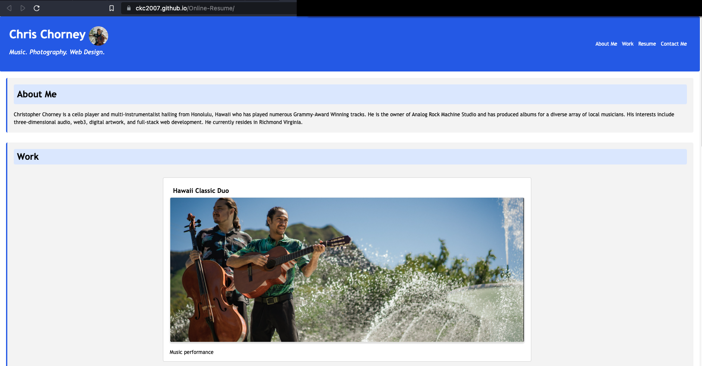
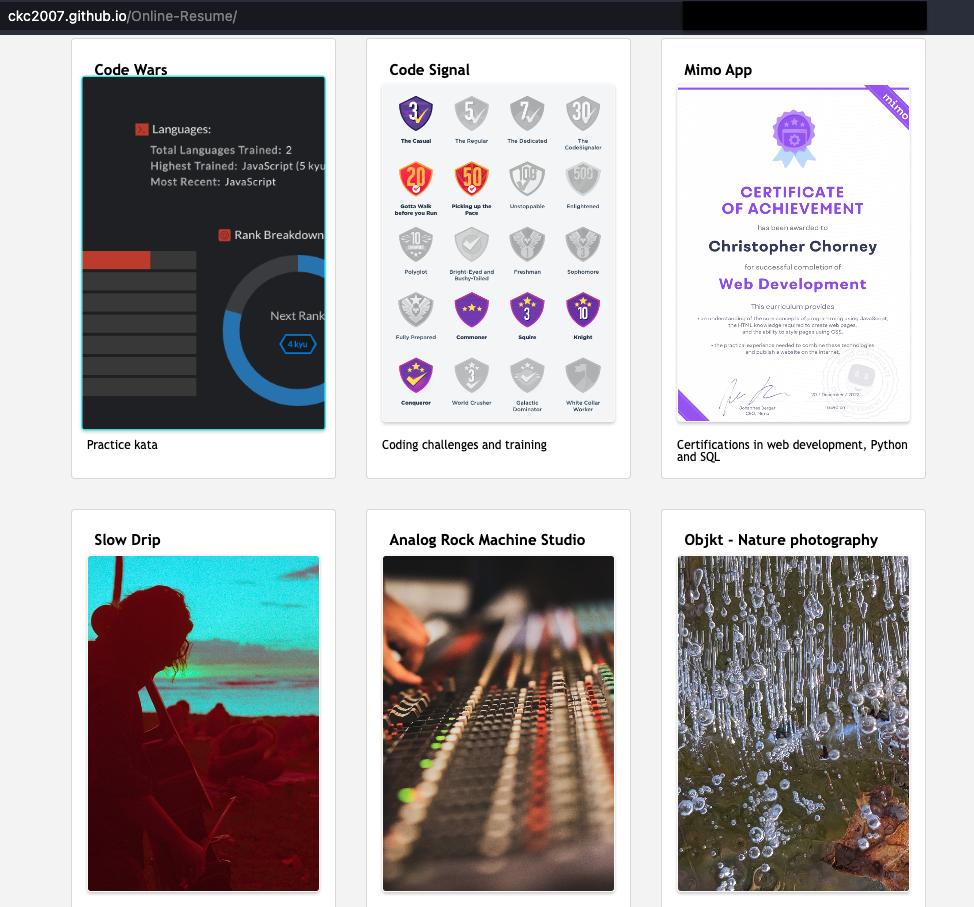
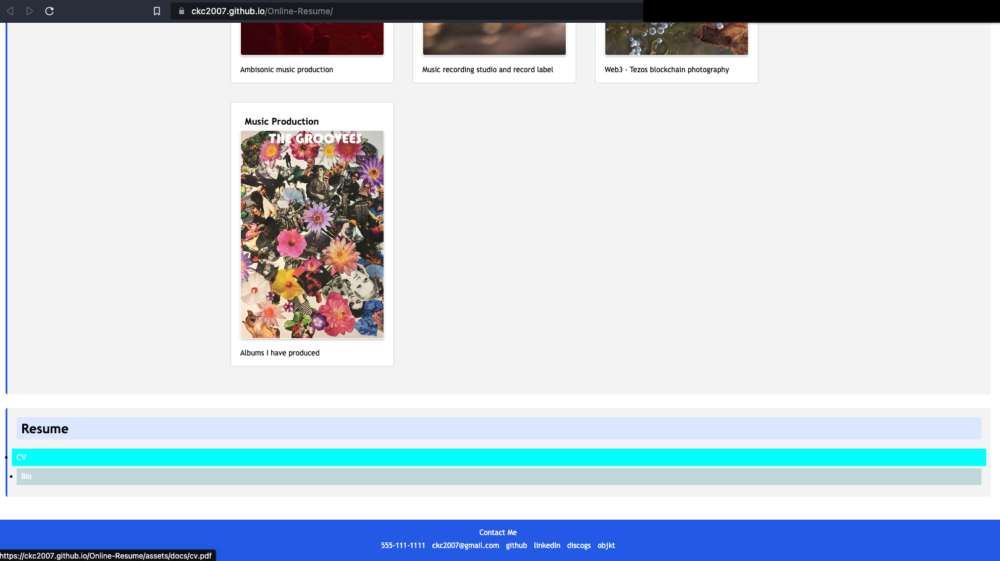

# Online Resume

Christopher Chorney's online resume for music, art and web design.

## Description

- This online resume contains a short "About Me" and links to my most recent work in music, art and web design.
- This page demonstrates skills learned in the University of Richmond coding bootcamp program and reflects a modern aesthetic and dynamic css with a mobile-first approach.
- Access my resume and bio anywhere!
- The developer learned about mobile-first approaches to web desgin, and has implemented dynamic css to create a responsive and attractive online resume and gallery with links to relevant work experience.

## Installation

No installation required.

## Usage

Open this page in your browser or on your mobile device! Click on links to view associated web content.

## Screenshot / Link To Deployed Site

Deployed Site: [https://ckc2007.github.io/Online-Resume/]

## Contributing

Tutorials used in this project include:

- Mobile first: https://developer.mozilla.org/en-US/docs/Web/Progressive_web_apps/Responsive/Mobile_first
- "Using media queries": https://developer.mozilla.org/en-US/docs/Web/CSS/Media_Queries/Using_media_queries

## License

This project is licensed under the MIT license.

## Features

Links to my artistic projects, online resume and bio.

## Questions

Please direct questions to the owner of this repository at ckc2007@gmail.com

Owner GitHub page:
[ckc2007](https://github.com/ckc2007).

## Credits

This README was created using the README generator app by ckc2007!
visit the GitHub page to try it out:
[README Generator app by ckc2007](https://github.com/ckc2007/README-Generator)
