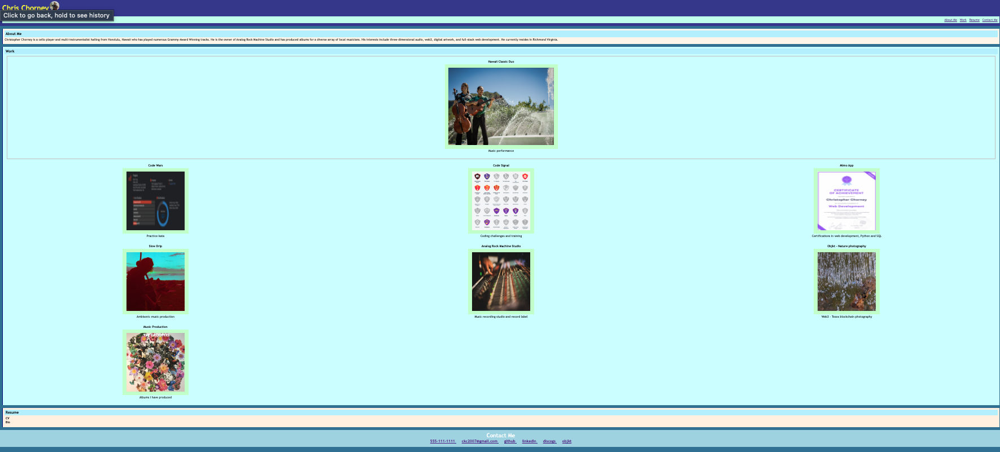

# Homework Week 02 - CSS Portfolio

## Description

I have created a personal resume page that has dynamic css elements that change when the screen is re-sized. focusable elements also change dynamically depending on their current state. 

The style is original - and meant to resemeble the homeowrk readme mock-up, though not precisely in this case.

I do not have any live applications (I hope to in the near future!), so instead I have included previous work in music, and links to a webpage I designed (Hawaii Classic Duo)

## User Story

AS A prospective employee in the field of web design
I WANT a webpage that dynamically and stylistically shows off my coidng skill
SO THAT I can have all my work in one place as a kind of online resume, and to demonstrate my competence and skill in html, css and responsive web design.

## Acceptance Criteria

GIVEN I need to create a comprehensive online portfolio
WHEN I scroll to the work section
THEN the most important work is larger than the others (first)
WHEN I click on links in the nav bar, 
THEN they take me to the relevant sections
WHEN I click on an image in the work section
THEN it takes me to the deployed page
WHEN I scroll to the resume section
THEN I find my cv and resume files (not yet implemented here)
WHEN I change the view size of the scree
THEN my page changes dynamically to accomodate diffrent sized screens
WHEN I scroll to the bottome
THEN I find a footer with relevant contact info and links

## Mock-Up

here is a screenshot of my deployed page:

